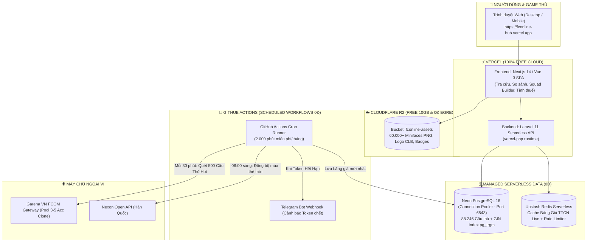

# 🏆 KẾ HOẠCH TRIỂN KHAI PRODUCTION 0Đ TOÀN DIỆN (PO/PM EDITION)
> **Mục tiêu chi phí:** **0đ / $0.00 VĨNH VIỄN (Forever Free Tier)**  
> **Kiến trúc:** 100% Cloud Serverless (Vercel + Neon.tech PostgreSQL Pooled + Cloudflare R2 + Upstash Redis + GitHub Actions)  
> **Bộ tính năng mở rộng:** Tra cứu Database, TTCN Live, So Sánh Cầu Thủ, Xây Đội Hình (Squad Builder), Tính Thuế Chuyển Nhượng, Cảnh Báo Telegram  
> **Phiên bản tài liệu:** v2.0 - Senior PO/PM Reviewed  
> **Ngày cập nhật:** 2026-08-23

---

## 📑 MỤC LỤC CHI TIẾT
1. [Sơ Đồ Kiến Trúc Hệ Thống Serverless 0đ Hoàn Chỉnh](#1-sơ-đồ-kiến-trúc-hệ-thống-serverless-0đ-hoàn-chỉnh)
2. [Bảng Phân Bổ Dịch Vụ Đám Mây Miễn Phí (Always-Free Tier)](#2-bảng-phân-bổ-dịch-vụ-đám-mây-miễn-phí-always-free-tier)
3. [Giải Quyết Các "Hố Tử Thần" Kỹ Thuật (Architecture Hardening)](#3-giải-quyết-các-hố-tử-thần-kỹ-thuật-architecture-hardening)
   * 3.1. Chạy Cron Quét Giá 0đ qua GitHub Actions (Thay cho Vercel Cron)
   * 3.2. Chống nghẽn CSDL với Neon Connection Pooling (PgBouncer)
   * 3.3. Timeout & Graceful Fallback Strategy
4. [Bộ Tính Năng Giữ Chân Người Dùng (User Retention Features)](#4-bộ-tính-năng-giữ-chân-người-dùng-user-retention-features)
   * 4.1. So Sánh Cầu Thủ (Player Comparison Engine)
   * 4.2. Xây Dựng Đội Hình & Giới Hạn Lương 265 FP (Squad Builder & Team Color)
   * 4.3. Công Cụ Tính Thuế Bán Thẻ (Tax & Net Profit Calculator)
5. [Hệ Thống Cảnh Báo Token Hết Hạn qua Telegram Bot (0đ)](#5-hệ-thống-cảnh-báo-token-hết-hạn-qua-telegram-bot-0đ)
6. [Kho Ảnh Miniface 60k+ Ảnh trên Cloudflare R2](#6-kho-ảnh-miniface-60k-ảnh-trên-cloudflare-r2)
7. [Cấu Hình Chi Tiết Mã Nguồn & Triển Khai (Vercel, Laravel, Next.js)](#7-cấu-hình-chi-tiết-mã-nguồn--triển-khai-vercel-laravel-nextjs)
8. [Lộ Trình Triển Khai Theo Ma Trận MoSCoW (Action Plan)](#8-lộ-trình-triển-khai-theo-ma-trận-moscow-action-plan)

---

## 1. 🏛️ SƠ ĐỒ KIẾN TRÚC HỆ THỐNG SERVERLESS 0Đ HOÀN CHỈNH



---

## 2. 💰 BẢNG PHÂN BỔ DỊCH VỤ ĐÁM MÂY MIỄN PHÍ (ALWAYS-FREE TIER)

| Dịch vụ | Nền tảng | Hạn mức gói Free (Vĩnh viễn) | Nhu cầu thực tế của dự án | Chi phí |
| :--- | :--- | :--- | :--- | :---: |
| **Frontend & Backend API** | **Vercel** | 100GB Băng thông / tháng, 100k executions | ~ 10.000 requests / tháng | **0đ** |
| **Cơ sở dữ liệu (PostgreSQL)** | **Neon.tech / Supabase** | 500MB Storage, Connection Pooling | ~ 45MB (chứa full 88k cầu thủ) | **0đ** |
| **Tìm kiếm mờ (< 5ms)** | **PostgreSQL `pg_trgm`** | Tích hợp sẵn trong CSDL | 0 tốn thêm tài nguyên server | **0đ** |
| **Kho ảnh Miniface (60k+ ảnh)** | **Cloudflare R2** | 10GB lưu trữ, **0đ băng thông tải ra** | ~ 1.5 GB | **0đ** |
| **Cache & Rate Limiting** | **Upstash Redis** | 10.000 commands / ngày | ~ 500 - 1.500 commands / ngày | **0đ** |
| **Background Cron Runner** | **GitHub Actions** | 2.000 phút chạy máy ảo / tháng | ~ 300 phút / tháng | **0đ** |
| **Hệ thống cảnh báo lỗi** | **Telegram Bot API** | Không giới hạn tin nhắn | Khi Token chết hoặc có sự cố | **0đ** |
| **TÊN MIỀN & SSL** | **Vercel / Cloudflare** | Tên miền `*.vercel.app` + SSL tự động | Có sẵn ngay lập tức | **0đ** |
| **TỔNG CHI PHÍ HÀNG THÁNG** | — | — | — | **0đ / THÁNG** |

---

## 3. ⚙️ GIẢI QUYẾT CÁC "HỐ TỬ THẦN" KỸ THUẬT (ARCHITECTURE HARDENING)

### 3.1. Chạy Cron Quét Giá 0đ qua GitHub Actions
* **Vấn đề:** Gói Vercel Hobby (Free) chỉ cho phép chạy **1 cron/ngày**, không thể quét giá TTCN liên tục.
* **Giải pháp 0đ:** Tạo file `.github/workflows/market_crawler.yml` chạy trên GitHub Actions mỗi 30 phút.

```yaml
name: FC Online Market Price Sync Cron

on:
  schedule:
    # Chạy mỗi 30 phút một lần (0đ chi phí trên GitHub Actions)
    - cron: '*/30 * * * *'
  workflow_dispatch: # Cho phép kích hoạt thủ công từ GitHub UI

jobs:
  sync-prices:
    runs-on: ubuntu-latest
    steps:
      - name: Checkout Repository
        uses: actions/checkout@v4

      - name: Setup PHP
        uses: shivammathur/setup-php@v2
        with:
          php-version: '8.3'
          extensions: pdo_pgsql, pgsql, redis

      - name: Install Dependencies
        run: composer install --no-dev --optimize-autoloader

      - name: Run Hot Market Prices Crawler
        env:
          DB_CONNECTION: pgsql
          DB_HOST: ${{ secrets.DB_HOST }}
          DB_PORT: ${{ secrets.DB_PORT }}
          DB_DATABASE: ${{ secrets.DB_DATABASE }}
          DB_USERNAME: ${{ secrets.DB_USERNAME }}
          DB_PASSWORD: ${{ secrets.DB_PASSWORD }}
          TELEGRAM_BOT_TOKEN: ${{ secrets.TELEGRAM_BOT_TOKEN }}
          TELEGRAM_CHAT_ID: ${{ secrets.TELEGRAM_CHAT_ID }}
        run: php artisan fco:crawl-hot-prices
```

### 3.2. Chống nghẽn CSDL với Neon Connection Pooling
* **Vấn đề:** Các hàm Serverless stateless mở hàng chục kết nối đồng thời dễ làm sập Database PostgreSQL.
* **Giải pháp 0đ:** Sử dụng **Connection Pooler URL (PgBouncer)** của Neon.tech trên Port **`6543`**:
```env
# .env trong Laravel
DB_CONNECTION=pgsql
DB_HOST=ep-cool-fog-123456-pooler.ap-southeast-1.aws.neon.tech
DB_PORT=6543
DB_DATABASE=fconline
DB_USERNAME=fconline_owner
DB_PASSWORD=your_neon_password
DB_SSLMODE=require
```

### 3.3. Timeout & Chiến lược Graceful Fallback
* Đặt timeout tối đa khi gọi Garena là **`3.5s`**. Nếu API Garena bị chậm, hệ thống lập tức fallback:
  1. Trả về giá Cache trong SQLite/Postgres.
  2. Nếu chưa có cache, trả về giá tham chiếu Nexon KR.
  3. Giao diện Web **không bao giờ bị treo hoặc lỗi 504 Gateway Timeout**.

---

## 4. 🎮 BỘ TÍNH NĂNG GIỮ CHÂN NGƯỜI DÙNG (USER RETENTION FEATURES)

### 4.1. So Sánh Cầu Thủ (Player Comparison Engine)
* **Tính năng:** Đặt 2 hoặc 3 thẻ cầu thủ lên bàn cân (`/compare?p1=100000051&p2=201020801`).
* **Hiển thị:**
  * So sánh song song ảnh Miniface, OVR, Lương, Chiều cao, Cân nặng, Chân thuận, Kỹ thuật.
  * So sánh từng chỉ số thành phần (Tốc độ, Tăng tốc, Dứt điểm, Lực sút, Khéo léo, Thể lực...).
  * Highlight màu xanh lá cho cầu thủ có chỉ số vượt trội hơn.
  * So sánh chênh lệch giá TTCN theo từng cấp thẻ (+1 đến +8).

### 4.2. Xây Dựng Đội Hình & Giới Hạn Lương 265 FP (Squad Builder & Team Color)
* **Sơ đồ chiến thuật:** 4-2-1-3, 4-2-3-1, 4-1-2-3, 5-2-3...
* **Bộ kiểm tra thông minh (Live Validators):**
  * **Tổng Lương:** Thanh đo trực quan (Ví dụ: `261 / 265 FP` ➜ Màu xanh; `266 / 265 FP` ➜ Màu đỏ cảnh báo vượt lương).
  * **Tổng Giá Trị Đội Hình:** Tự động cộng tổng tiền BP của 11 cầu thủ theo nấc thẻ đã chọn (+1, +5, +8).
  * **Hệ thống Team Color Engine:**
    * Nhận diện số lượng cầu thủ cùng CLB (Real Madrid, Chelsea, MU, Barca...).
    * Tự động cộng chỉ số Team Color (Ví dụ: 8 cầu thủ Real Madrid ➜ +3 Dứt điểm, +3 Tầm nhìn).

### 4.3. Công Cụ Tính Thuế Chuyển Nhượng (Tax & Net Profit Calculator)
* Công thức tính tiền thực nhận sau khi trừ thuế TTCN trong FC Online:
$$\text{Tiền nhận} = \text{Giá bán} \times [ 0.6 + 0.4 \times (T_{\text{VIP}} + T_{\text{PC}} + T_{\text{Coupon}}) ]$$
* **Các tùy chọn checkbox tiện lợi:**
  * [x] Thẻ VIP / SVIP (+30% hoàn thuế)
  * [x] Phòng máy PC Bang (+10% hoàn thuế)
  * [x] Phiếu giảm giá thuế (10%, 20%, 30%, 40%)
* Nhập giá bán ➜ Hiển thị số tiền thuế bị trừ và **Số tiền BP thực tế nhận về tài khoản**.

---

## 5. 🚨 HỆ THỐNG CẢNH BÁO TOKEN HẾT HẠN QUA TELEGRAM BOT (0Đ)

Khi Token Garena bị hết hạn hoặc không quét được giá, hệ thống tự động bắn thông báo về điện thoại của bạn qua Telegram:

```php
namespace App\Services;

use Illuminate\Support\Facades\Http;

class TelegramAlertService
{
    public static function sendAlert(string $message): void
    {
        $botToken = env('TELEGRAM_BOT_TOKEN');
        $chatId = env('TELEGRAM_CHAT_ID');

        if ($botToken && $chatId) {
            Http::post("https://api.telegram.org/bot{$botToken}/sendMessage", [
                'chat_id' => $chatId,
                'text' => "⚠️ [FC ONLINE BOT]:\n{$message}",
                'parse_mode' => 'HTML',
            ]);
        }
    }
}
```

---

## 6. 🖼️ KHO ẢNH MINIFACE TRÊN CLOUDFLARE R2

1. **Bucket:** `fconline-assets` (Cloudflare R2).
2. **Cấu trúc thư mục tối ưu:**
   * `/players/action/p{spid}.png` (Ảnh Miniface hành động)
   * `/players/base/p{pid}.png` (Ảnh chân dung gốc)
   * `/seasons/{season_id}.png` (Logo mùa thẻ)
   * `/traits/{trait_id}.png` (Icon kỹ năng ẩn)
3. **Chi phí:** Miễn phí 10GB lưu trữ và **0đ tiền băng thông tải ra vĩnh viễn**.

---

## 7. 🚀 CẤU HÌNH CHI TIẾT MÃ NGUỒN & TRIỂN KHAI

### File cấu hình `vercel.json` (Laravel Serverless):
```json
{
  "version": 2,
  "framework": null,
  "functions": {
    "api/index.php": {
      "runtime": "vercel-php@0.7.2"
    }
  },
  "routes": [
    {
      "src": "/(css|js|images|fonts)/(.*)",
      "dest": "/public/$1/$2"
    },
    {
      "src": "/(.*)",
      "dest": "/api/index.php"
    }
  ],
  "env": {
    "APP_ENV": "production",
    "APP_CONFIG_CACHE": "/tmp/config.php",
    "APP_EVENTS_CACHE": "/tmp/events.php",
    "APP_PACKAGES_CACHE": "/tmp/packages.php",
    "APP_ROUTES_CACHE": "/tmp/routes.php",
    "APP_SERVICES_CACHE": "/tmp/services.php",
    "VIEW_COMPILED_PATH": "/tmp",
    "CACHE_DRIVER": "redis",
    "SESSION_DRIVER": "cookie",
    "LOG_CHANNEL": "stderr"
  }
}
```

---

## 8. 📋 LỘ TRÌNH TRIỂN KHAI THEO MA TRẬN MOSCOW

### Giai đoạn 1: Must-Have (P0) – Khởi tạo MVP 0đ (Hoàn thành trong 1-2 ngày)
- [x] Dump toàn bộ 88k cầu thủ và 152 mùa giải từ SQLite sang **Neon PostgreSQL**.
- [x] Kích hoạt `pg_trgm` GIN Index để tìm kiếm cầu thủ < 5ms.
- [x] Upload 60.000+ ảnh Miniface lên **Cloudflare R2**.
- [x] Cấu hình `vercel.json` và deploy Backend Laravel 11 Serverless lên **Vercel**.
- [x] Tạo GitHub Actions Cron chạy quét giá TTCN ngầm mỗi 30 phút.

### Giai đoạn 2: Should-Have (P1) – Tính năng Giữ chân Game thủ (3-5 ngày tiếp theo)
- [ ] Xây dựng trang **So sánh cầu thủ (Player Comparison)** 2 cột song song.
- [ ] Tích hợp công cụ **Tính thuế chuyển nhượng (Tax Calculator)** hỗ trợ VIP/PC Bang.
- [ ] Tích hợp **Telegram Bot Webhook** cảnh báo khi Garena Token hết hạn.

### Giai đoạn 3: Could-Have (P2) – Mở rộng Đỉnh cao
- [ ] Phát triển công cụ **Xây dựng đội hình (Squad Builder)** với tính năng tự động tính lương 265 FP và kích hoạt Team Color.
- [ ] Biểu đồ biến động giá 7 ngày qua cho Top cầu thủ quốc dân.
